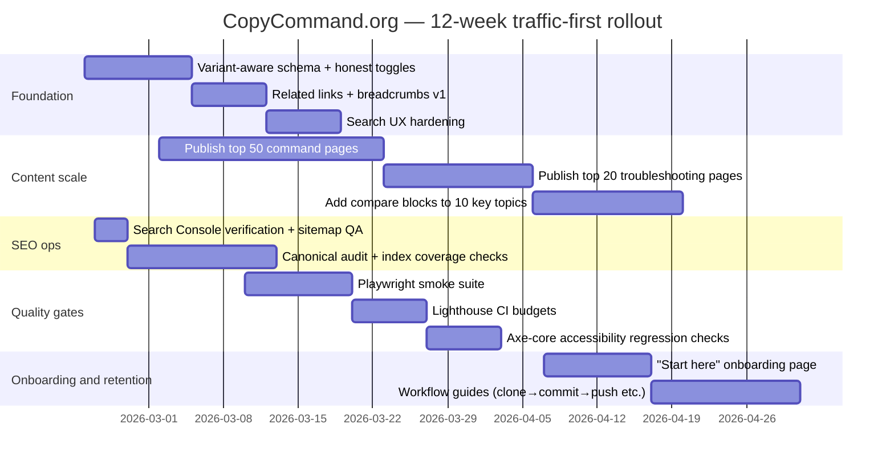

# Building CopyCommand.org as a Traffic-First, Learning-Focused Dev Utility

## Executive summary

CopyCommand.org can win organic search by specialising in a specific, under-served intersection: **task-intent command queries** (“how do I…”, “command example…”, “what does … do?”) while providing **copy-first UX** plus a **beginner learning layer** that official docs and Q&A sites often lack. Across representative SERPs for common commands (Git, Docker, permissions, cURL), the consistent pattern is that top results are either (a) authoritative but verbose docs with weaker “copy utility”, or (b) fast answers/cheatsheets with thin explanations and limited trust signals. For example, official docs pages tend to include deep navigation and strong internal linking (e.g., Docker docs include a prominent table of contents and “next steps” guidance), but they are not optimised for “copy-paste then understand” workflows. citeturn11view3turn3view7

The strategic priority is therefore to scale a **programme of high-intent, indexable command pages** that are:
- **Accurate** (avoid misleading OS toggles; only show variants when they differ).
- **Composable** (packs → command pages → related commands → onboarding).
- **Crawlable** (clean canonicals, robust sitemaps, stable slugs).
- **Fast** (static generation by default; performance budgets aligned to Core Web Vitals). citeturn13search4turn13search1

Key recommendations:
1. **Codify a variant-aware data model** so that Windows PowerShell vs Mac/Linux toggles change the command when necessary (and disappear when not). This directly addresses trust and reduces “copy fails” outcomes.
2. **Build a programmatic SEO system**: command pages as the atomic unit, packs as hubs, onboarding as conversion/retention, with structured internal linking heuristics.
3. **Operationalise SEO** via Search Console verification, sitemap hygiene, canonical consolidation, and cadence rules (especially for lastmod). citeturn15search0turn6search17
4. **Harden UX and QA**: instant copy feedback using Clipboard API, keyboard shortcuts disclosed via `aria-keyshortcuts`, accessible names, and automated regression checks via Playwright + Lighthouse CI + axe-core. citeturn12search0turn12search1turn14search7turn14search0turn13search11

## Market and competitor landscape

The competitor set below reflects recurring top-ranking domains observed on common command queries (e.g., `git status`, `docker build`, `npm install`, `chmod 755`, `curl post json`). citeturn0search0turn0search7turn1search0turn0search5turn0search16turn0search6

### Competitor comparison table

| Site (top results pattern) | Positioning for command queries | Content depth | SEO signals & IA | Monetisation / CTA posture | Notes |
|---|---:|---:|---|---|---|
| entity["organization","Stack Overflow","q&a platform"] | Q&A “one page answer” for long-tail | High variance (excellent answers mixed with noise) | Extremely strong indexing; query-specific pages; visible engagement + freshness (“modified”), huge views | Ads + “Teams/Stack Internal” + “Stack Ads” product funnel | A single thread can dominate a query for years (example shows 4.9m views). citeturn4view2 |
| entity["company","Atlassian","software company"] | Tutorials + product-adjacent learning | Medium–high | Clean headings, examples, “related material”, interlinks to adjacent concepts | Lead-gen (“Get it free”), product ecosystem (Bitbucket etc.) | Strong “next concept” linking; acts as a hub. citeturn4view1turn11view1 |
| entity["company","Docker","container platform company"] | Official documentation (task+concept) | High | TOC, step-by-step, “Edit on GitHub”; often includes “next steps” | Product ecosystem (Docker Desktop, Hub); docs tooling | Notable “Copy as Markdown” + AI help affordances on docs pages. citeturn11view3turn3view7 |
| entity["organization","npm Docs","npm cli documentation"] | Official CLI reference | Very high | Version selector, deep TOC, extensive cross-linking (“See Also”) | Ecosystem/product, not ads | Great for completeness, weaker for beginner “which flags matter” prioritisation. citeturn11view5turn11view4 |
| entity["organization","git-scm.com","git documentation site"] | Official command reference | Very high | Strong “synopsis/options” structure; stable doc pages | None obvious; community-driven docs | Authoritative but dense; hard for beginners to choose safe defaults. citeturn11view6turn2view8 |
| entity["organization","curl.se","curl project site"] | Official tutorial + reference | High | Tutorial format, examples; stable pages | None obvious | Strong for correctness; can be too broad for “just give me a working POST with headers” intent. citeturn11view8turn2view9 |
| entity["company","GeeksforGeeks","education platform"] | Tutorials + quick explanations | Medium | “Last updated” visible; extensive topical navigation | Courses and broader learning catalogue | Competes on breadth; quality varies; good signal: explicit “Last Updated”. citeturn4view0turn10view8 |
| entity["company","Warp","terminal app company"] | Command glossary (“Terminus”) + product | Medium | Short answer + examples + related articles | Strong product CTA: pricing, download, “Run in Warp” | Excellent model for “copy utility + explanation + product funnel”. citeturn2view2turn10view7turn3view5 |
| entity["organization","Devhints.io","developer cheatsheets site"] | Cheatsheets (fast scanning) | Medium | Single-page references; community edit link | Minimal monetisation visible; OSS-ish editing | Wins on speed, loses on “what can go wrong” and OS variance. citeturn2view0turn10view4 |
| entity["organization","QuickRef.ME","cheatsheet site"] | Cheatsheets + keyboard-driven search | Medium | Search affordance, long-form cheatsheet pages | Social follow; monetisation not prominent | Strong “⌘K search” affordance; useful UX inspiration. citeturn2view1turn10view5 |

### Competitive gaps CopyCommand.org can own

A repeatable “gap wedge” appears across these leaders:

- **Official docs** optimise for completeness and correctness (TOCs, “See Also”, deep options) but not for *fast copying* and *beginner decision-making*. citeturn11view5turn11view6turn11view3  
- **Q&A** dominates long-tail troubleshooting, but pages are noisy, inconsistent, and not designed as a “command system”. citeturn4view2  
- **Cheatsheets** are fast but thin; they rarely guide safe usage, OS differences, or common mistakes. citeturn2view0turn2view1  
- **Product glossaries** (e.g., “Run in …”) show the power of combining a short answer, copy utility, and optionally a funnel. citeturn2view2turn3view5  

CopyCommand.org’s defensible positioning is therefore: **“copy-ready commands with training wheels”**—and selectively remove the training wheels.

## Keyword and intent research

### How to treat “volume” rigorously without pretending precision

Keyword volume is inherently an estimate (and differs by tool and locale). Even major SEO tool vendors explicitly describe search volume as directional rather than perfectly accurate. citeturn8search6  
For planning, use **volume tiers** (ranges) and validate the winners in Search Console after publishing. Search Console’s Performance reporting is the ground truth for impressions/clicks once pages are indexed. citeturn15search3turn15search7

**Volume tiers used in the 100-keyword table**
- **Head**: 10k+/month (global, broad intent)
- **Mid**: 1k–10k/month
- **Long-tail**: 100–1k/month
- **Ultra long-tail**: <100/month (often “error + context”)

This approach is consistent with the reality that long-tail keywords are numerous and individually smaller, but collectively powerful—many tools explicitly highlight long-tail discovery as a core capability of keyword generators. citeturn9view0

### Intent mapping

Command search intent clusters reliably into these page archetypes:

- **Do the thing**: “command + example”, “how to … using …” → best served by a **command page** with a working default + safe variants.
- **Understand the thing**: “what does … do”, “difference between …” → **command page** plus a **comparison block** and “common mistakes”.
- **Fix the thing**: “error”, “permission denied”, “not recognised”, “fatal” → **troubleshooting page** (can reuse the same template but with error-focused structure).
- **Browse**: “cheat sheet”, “common commands”, “best commands for …” → **pack/hub page** and **onboarding**.

### Suggested 100 keywords grouped by category

The table below is a traffic-first seed set. Each keyword maps to a recommended page type to keep production systematic.

| Category | Keyword (query) | Volume tier | Primary intent | Recommended page |
|---|---|---:|---|---|
| Git basics | git clone command | Head | Do | Command page |
| Git basics | git clone branch | Mid | Do | Command page |
| Git basics | git clone private repo ssh | Long-tail | Do | Command page |
| Git basics | git status command | Head | Understand/Do | Command page |
| Git basics | git add all files | Mid | Do | Command page |
| Git basics | git commit message | Mid | Do | Command page |
| Git basics | git commit amend | Mid | Do | Command page |
| Git basics | git push set upstream | Mid | Do | Command page |
| Git basics | git pull rebase | Mid | Do | Command page |
| Git basics | git fetch vs pull | Mid | Understand | Comparison page (or command page + compare) |
| Git basics | git log oneline | Mid | Do | Command page |
| Git basics | git diff staged | Mid | Do | Command page |
| Git basics | git checkout file revert changes | Mid | Fix | Command page |
| Git basics | git switch branch | Mid | Do | Command page |
| Git basics | git merge branch | Mid | Do | Command page |
| Git basics | git rebase interactive | Mid | Do/Learn | Command page |
| Git basics | git cherry-pick | Mid | Do | Command page |
| Git basics | git stash save | Mid | Do | Command page |
| Git basics | git stash pop | Mid | Do | Command page |
| Git basics | git tag create | Long-tail | Do | Command page |
| Git basics | .gitignore example | Mid | Do | Command page |
| Git troubleshooting | undo last git commit | Head | Fix | Troubleshooting page |
| Git troubleshooting | undo git add | Mid | Fix | Troubleshooting page |
| Git troubleshooting | detached head git | Mid | Fix | Troubleshooting page |
| Git troubleshooting | git merge conflict resolve | Mid | Fix | Troubleshooting page |
| Git troubleshooting | git reset hard | Head | Fix/Do | Command page + warnings |
| Git troubleshooting | git revert commit | Mid | Fix | Command page |
| GitHub CLI | gh auth login | Long-tail | Do | Command page |
| GitHub CLI | gh repo clone | Long-tail | Do | Command page |
| GitHub CLI | gh pr create | Long-tail | Do | Command page |
| GitHub CLI | gh pr checkout | Long-tail | Do | Command page |
| Docker basics | docker build command | Head | Do | Command page |
| Docker basics | docker build tag | Mid | Do | Command page |
| Docker basics | docker build no cache | Mid | Do | Command page |
| Docker basics | docker run example | Head | Do | Command page |
| Docker basics | docker run port mapping | Mid | Do | Command page |
| Docker basics | docker ps | Mid | Do | Command page |
| Docker basics | docker images | Mid | Do | Command page |
| Docker basics | docker exec into container | Mid | Do | Command page |
| Docker basics | docker logs follow | Mid | Do | Command page |
| Docker basics | docker stop container | Mid | Do | Command page |
| Docker basics | docker rm force | Mid | Do | Command page |
| Docker basics | docker system prune | Mid | Do | Command page |
| Docker compose | docker compose up | Head | Do | Command page |
| Docker compose | docker compose down | Mid | Do | Command page |
| Docker compose | docker compose logs | Mid | Do | Command page |
| Docker troubleshooting | docker permission denied | Mid | Fix | Troubleshooting page |
| Node/NPM | npm install command | Head | Do | Command page |
| Node/NPM | npm install save dev | Mid | Do | Command page |
| Node/NPM | npm ci vs npm install | Mid | Understand | Comparison page |
| Node/NPM | npm audit fix | Mid | Fix | Command page |
| Node/NPM | npm run build | Mid | Do | Command page |
| Node/NPM | npm link | Mid | Do | Command page |
| Node/NPM | npx command | Mid | Learn/Do | Command page |
| Node/NPM | node -v check version | Mid | Do | Command page |
| Node/NPM | nvm install node | Mid | Do | Command page |
| Node troubleshooting | npm ERESOLVE fix | Long-tail | Fix | Troubleshooting page |
| Node troubleshooting | npm permission denied | Long-tail | Fix | Troubleshooting page |
| Linux basics | ls command options | Head | Learn/Do | Command page |
| Linux basics | cd command | Mid | Learn/Do | Command page |
| Linux basics | mkdir -p | Mid | Do | Command page |
| Linux basics | rm -rf meaning | Mid | Learn | Command page + warnings |
| Linux basics | cp -r | Mid | Do | Command page |
| Linux basics | mv command | Mid | Do | Command page |
| Linux basics | cat vs less | Mid | Understand | Comparison page |
| Linux basics | head -n | Mid | Do | Command page |
| Linux basics | tail -f | Mid | Do | Command page |
| Linux basics | grep recursive | Head | Do | Command page |
| Linux basics | sed replace example | Mid | Do | Command page |
| Linux basics | awk print column | Long-tail | Do | Command page |
| Linux basics | tar extract | Head | Do | Command page |
| Linux basics | zip unzip command | Mid | Do | Command page |
| Search/files | find command examples | Head | Do | Command page / pack page |
| Search/files | find file by name linux | Mid | Do | Command page |
| Search/files | grep exclude directory | Long-tail | Do | Command page |
| Permissions | chmod 755 meaning | Head | Understand | Command page |
| Permissions | chmod 644 meaning | Mid | Understand | Command page |
| Permissions | chmod +x | Head | Do | Command page |
| Permissions | chmod 777 | Head | Learn/Warn | Command page + warnings |
| Permissions | chown command | Head | Do | Command page |
| Permissions | sudo command | Head | Learn/Do | Command page |
| Permissions | umask meaning | Mid | Understand | Command page |
| HTTP/cURL | curl POST request | Head | Do | Command page |
| HTTP/cURL | curl POST json | Head | Do | Command page |
| HTTP/cURL | curl GET with headers | Mid | Do | Command page |
| HTTP/cURL | curl bearer token | Mid | Do | Command page |
| HTTP/cURL | curl download file | Mid | Do | Command page |
| HTTP/cURL | curl upload file multipart | Mid | Do | Command page |
| HTTP/cURL | curl follow redirects | Mid | Do | Command page |
| HTTP/cURL | curl verbose | Mid | Troubleshoot | Command page |
| SSH/files | ssh generate key | Head | Do | Command page |
| SSH/files | ssh copy key to server | Mid | Do | Command page |
| SSH/files | scp copy file | Mid | Do | Command page |
| SSH/files | rsync example | Mid | Do | Command page |
| System/network | lsof port 3000 | Long-tail | Fix | Troubleshooting page |
| System/network | kill process on port | Mid | Fix | Troubleshooting page |
| System/network | systemctl restart service | Mid | Do | Command page |
| System/network | journalctl logs | Mid | Do | Command page |
| Windows equivalents | PowerShell rm -rf equivalent | Long-tail | Do | Command page (variants) |
| Windows equivalents | PowerShell ls equivalent | Long-tail | Learn/Do | Command page (variants) |
| macOS tooling | brew install | Head | Do | Command page |
| Windows tooling | winget install node | Long-tail | Do | Command page |
| Prisma/DB | prisma migrate dev | Long-tail | Do | Command page |
| Prisma/DB | prisma generate | Long-tail | Do | Command page |
| Prisma/DB | prisma studio | Long-tail | Do | Command page |
| Databases | pg_dump backup | Long-tail | Do | Command page |
| Databases | psql connect | Long-tail | Do | Command page |
| Packaging | create tar.gz | Mid | Do | Command page |
| Packaging | extract tar.gz | Mid | Do | Command page |

## Information architecture and content system

### Content templates (exact page structure)

The goal is to standardise pages so they are **easy to scale**, while still feeling human and trustworthy.

#### Command page template (/[pack]/[command])

Recommended structure (top → bottom):

1. **H1 title**: “`git clone` — Copy-ready examples & explanation”
2. **One-sentence summary** (40–160 chars): what the command accomplishes.
3. **Variant selector** (only if variants differ):  
   - “Mac/Linux (bash/zsh)” vs “Windows PowerShell”  
   - Hide selector when command text is identical (trust preservation).
4. **Primary copy block** (default, safe example)  
   - Copy button (single action)  
   - Optional: “Copy as multiline script” vs “Copy as one-liner”
5. **What it does** (2–5 lines)
6. **When to use it** (2–5 lines; include “when not to”)
7. **Examples** (3–8 examples, increasing complexity)
8. **Common mistakes** (3–6; include the fix)
9. **Related commands** (next/previous + heuristics)
10. **Source links** (official docs + 1 tutorial + 1 Q&A when relevant)
11. **Updated date** + “Report an issue / Suggest edit” (trust loop)

This mirrors what consistently performs in high-ranking pages: clear headings, examples, and extensive internal linking (“See also”, “next steps”). citeturn11view4turn11view3turn11view1

#### Pack page template (/[pack])

Recommended structure:

- H1: “Git commands you’ll actually use”
- 2–3 lines on “who it’s for”
- “Start here” (3–5 recommended commands in learning order)
- Search/filter within pack
- Command table/cards (each links to command page)
- “Common workflows” section: e.g., “clone → status → add → commit → push”
- Links to 2–4 adjacent packs (internal linking)

#### Onboarding page template (/start-here)

Purpose: convert cold organic visitors into repeat users by giving a **path**, not just a snippet.

- Choose: “I’m on Windows / Mac / Linux”
- Choose: “Beginner / Intermediate”
- “First 10 commands” with explanations
- Mini-glossary: “flags”, “arguments”, “pipes”
- Safety: “commands that can delete things” flagged with warning patterns

### Metadata examples (Next App Router)

Next.js supports static metadata exports or `generateMetadata` for dynamic routes. citeturn5search0turn5search4

Example metadata for a command page:

```ts
// app/[packId]/[commandId]/page.tsx
export async function generateMetadata({ params }: { params: { packId: string; commandId: string } }) {
  const { packId, commandId } = params
  // load command from local data
  const cmd = getCommand(packId, commandId)

  return {
    title: `${cmd.name} — CopyCommand`,
    description: cmd.learning.whatItDoes.slice(0, 155),
    alternates: { canonical: `https://copycommand.org/${packId}/${commandId}` },
    openGraph: {
      title: `${cmd.name} — CopyCommand`,
      description: cmd.learning.whatItDoes,
      url: `https://copycommand.org/${packId}/${commandId}`,
      type: "article",
    },
  }
}
```

### Schema.org markup

Use structured data conservatively: it should accurately reflect the page. Google’s guidance for Article structured data emphasises adding properties that apply and validating markup. citeturn6search3

Recommended baseline:
- `TechArticle` for the explanation layer. citeturn7search0  
- `BreadcrumbList` for navigational clarity. citeturn7search2  
- Optional: `SoftwareSourceCode` to describe the snippet itself. citeturn7search1  

Example JSON-LD (embed once per command page):

```html
<script type="application/ld+json">
{
  "@context": "https://schema.org",
  "@graph": [
    {
      "@type": "BreadcrumbList",
      "itemListElement": [
        { "@type": "ListItem", "position": 1, "name": "Home", "item": "https://copycommand.org/" },
        { "@type": "ListItem", "position": 2, "name": "Git", "item": "https://copycommand.org/git" },
        { "@type": "ListItem", "position": 3, "name": "git clone", "item": "https://copycommand.org/git/git-clone" }
      ]
    },
    {
      "@type": "TechArticle",
      "headline": "git clone — Copy-ready examples & explanation",
      "description": "Clone a Git repository locally (safe examples, options, and common mistakes).",
      "mainEntityOfPage": { "@type": "WebPage", "@id": "https://copycommand.org/git/git-clone" },
      "dateModified": "2026-02-22",
      "author": { "@type": "Organization", "name": "CopyCommand" }
    },
    {
      "@type": "SoftwareSourceCode",
      "name": "git clone (example)",
      "programmingLanguage": "Shell",
      "text": "git clone https://github.com/org/repo.git"
    }
  ]
}
</script>
```

## Data model design for scalable content

A traffic system lives or dies on its **content schema**. The schema must support:
- stable URLs (slugs),
- OS/shell variants (only when needed),
- tags/tools for related-link heuristics,
- prioritisation metadata (RICE) so you know what to write next.

### Recommended TypeScript schema

```ts
export type Platform = "mac" | "linux" | "windows"
export type Shell = "bash" | "zsh" | "fish" | "powershell" | "cmd"

export type Intent = "do" | "learn" | "fix" | "compare" | "browse"

export type Rice = {
  reach: number        // relative scale 1–10
  impact: number       // 0.25, 0.5, 1, 2, 3
  confidence: number   // 0–1
  effortHours: number
}

export type CommandVariant = {
  platform: Platform
  shell?: Shell
  command: string                 // what gets copied
  notes?: string                  // variant-specific footnote
}

export type CommandLearning = {
  whatItDoes: string
  whenToUse: string
  examples: Array<{ title: string; snippet: string; explanation: string }>
  commonMistakes: Array<{ mistake: string; fix: string }>
  warnings?: string[]             // e.g. destructive / privileged / network
}

export type Command = {
  id: string                      // stable internal ID (kebab-case)
  slug: string                    // URL: usually equals id
  name: string                    // display name ("git clone")
  primaryIntent: Intent
  tools: string[]                 // ["git"]
  tags: string[]                  // ["repo", "clone", "ssh"]
  defaultVariantKey: string       // e.g. "mac:bash"
  variants: Record<string, CommandVariant> // key = `${platform}:${shell}`
  learning: CommandLearning
  sources: Array<{ label: string; url: string }>
  lastReviewed: string            // ISO date
  rice?: Rice                     // editorial prioritisation
}

export type Pack = {
  id: string                      // e.g. "git"
  slug: string                    // e.g. "git"
  title: string                   // "Git"
  description: string
  order: number
  commands: Command[]
  rice?: Rice
}
```

### Why variants must be first-class (and not just a UI toggle)

If “Windows PowerShell” and “Mac/Linux Terminal” toggles do not change the copied command when they should, users experience a silent failure and trust collapses. Variant-aware content also creates a scalable editorial practice: you can start with one canonical snippet, then add platform variants only for commands that genuinely differ (paths, environment variables, delete operations, package managers).

## UX patterns for “copy-first + learn”

### Copy interaction design

Use the Clipboard API for modern browsers (`navigator.clipboard.writeText`) and design feedback as part of the product’s “dopamine loop”. citeturn12search0turn12search12

Recommended behaviour:
- Default label: “Copy”
- On success: change to “Copied ✓” for 1.2–2.0 seconds, then revert
- On failure (no permission): show a non-blocking hint: “Press Ctrl+C / ⌘C”
- Preserve focus: after clicking Copy, keep keyboard focus on the button (supports power users and accessibility)

### Keyboard shortcuts (power-user utility without breaking accessibility)

If you implement shortcuts, **announce them** with `aria-keyshortcuts`. citeturn12search1  
Also avoid claiming system-reserved chords (browsers/OS intercept some keys). citeturn12search21

Suggested shortcuts:
- `/` → focus global search (common pattern)
- `c` → copy current command (when focus is within command card)
- `n` / `p` → next/previous command page (on command routes only)
- `Esc` → close search modal/clear focus

### Mobile layout

Design assumption: many users will open on mobile and copy to a desktop later, or use mobile terminals. Mobile needs:
- sticky copy button (but not blocking content),
- large tap targets,
- code blocks with horizontal scroll and “copy” pinned.

### Accessibility (non-negotiable for a utilities site)

Minimum standard:
- every interactive element has a **non-empty accessible name**. citeturn12search7turn12search3  
- visible focus indicator (keyboard users). citeturn12search14turn12search2  
- copy feedback announced to screen readers (ARIA live region) but not noisy.

## Internal linking strategy for compounding crawl depth

Internal linking is how your site becomes a “graph” instead of a set of pages. It also reduces your reliance on sitemaps (which are a hint, not a guarantee). citeturn6search1

### Breadcrumbs and hierarchy

- Home → Pack → Command  
- Implement both UI breadcrumbs and `BreadcrumbList` structured data. citeturn7search2

### Related-link heuristics (practical, rank-oriented)

Start with deterministic heuristics, evolve later:

1. **Pack adjacency**: previous/next by pack order (always available).  
2. **Shared tool**: same `tools[]` value (git/docker/npm).  
3. **Shared tag overlap**: Jaccard similarity of tags (threshold-based), capped at 6 links.  
4. **Workflow templates**: curated sequences, e.g., “clone → status → add → commit → push”.

This aligns with what strong doc ecosystems already do (“See Also”, “Next steps”, “Related material”). citeturn11view4turn11view3turn11view1

### Pagination and crawl paths

For packs with many commands:
- Add “Page 1/2/3” pagination after a threshold (e.g., 60 items), but keep the full list discoverable via sitemap to avoid orphaning.
- Ensure links are plain `<a>`/Next `<Link>` so bots can crawl without client-side state.

## Technical implementation in Next.js 14 App Router

### Routing and static generation strategy

Command content is deterministic and local, so the default should be **static generation** (fast, cacheable, cheap). Next.js supports pre-rendering dynamic routes at build time via `generateStaticParams`. citeturn17search1  
For scaling to thousands of command pages, static generation remains viable; if build time becomes a bottleneck, consider partial generation with ISR (revalidation) rather than making everything runtime-rendered. citeturn17search0turn5search3

### Metadata and crawl endpoints

- `generateMetadata` for per-command titles/descriptions. citeturn5search0  
- `app/sitemap.ts` for sitemap generation (cached by default unless dynamic APIs are used). citeturn16view0  
- `app/robots.ts` for robots rules and sitemap declaration. citeturn16view1  
- If URLs exceed practical limits, split sitemaps with `generateSitemaps`. citeturn16view2  

### Sitemap mechanics and cadence

Google documents sitemap submission as a hint (not a guarantee) and supports multiple formats. citeturn6search1  
A best practice is to keep `<lastmod>` meaningful (only update when content changes in ways visible in search results). citeturn6search17

### Canonicals and duplicate control

Consolidate www/non-www and enforce a canonical strategy; Google provides explicit guidance for canonicalisation and duplicate URLs. citeturn6search0turn6search4  
Avoid canonical mistakes like pointing category pages to a featured article when the category should rank. citeturn6search12

## Analytics, SEO operations, roadmap, and QA

### Crawlability and Search Console ops

Operational checklist:
- Verify domain ownership in Search Console (DNS method is standard for Domain properties). citeturn15search0turn15search12  
- Submit sitemap in the Sitemaps report and monitor errors. citeturn15search2turn15search6  
- Use URL Inspection to see the Google-selected canonical vs user-declared canonical. citeturn15search1turn15search9  
- Remember robots.txt is not a way to remove content from results; use `noindex` or authentication for exclusion. citeturn6search2  

### Performance budgets and Web Vitals

Core Web Vitals measure real-world UX (LCP, INP, CLS) and are recommended for Search success; Google’s documentation emphasises this while noting they are not the only ranking considerations. citeturn13search1turn13search9  
Practical budgets for a command-utility site:
- LCP: aim ≤ 2.5s  
- INP: aim ≤ 200ms  
- CLS: aim ≤ 0.1 citeturn13search4  

### Testing and QA tooling

- End-to-end smoke tests with Playwright (officially recommended and documented for Next.js). citeturn14search7turn13search6  
- Accessibility regression checks with axe-core (designed for automated testing integration). citeturn14search0  
- Continuous performance checks with Lighthouse CI (assert against budgets to prevent regressions). citeturn14search10turn13search11  

### Content template checklist table

| Template element | Command page | Pack page | Onboarding | Notes |
|---|---:|---:|---:|---|
| Unique H1 matching query intent | ✓ | ✓ | ✓ | Avoid generic titles |
| One-sentence summary (SERP-friendly) | ✓ | ✓ | ✓ | Also becomes meta description seed |
| Copy button + feedback | ✓ | ✓ (bulk copy) | ✓ | Uses Clipboard API citeturn12search0 |
| Variant handling (OS/shell) | ✓ | ✓ | ✓ | Only show toggle if variants differ |
| “What it does” | ✓ | — | ✓ | Beginner layer |
| “When to use” | ✓ | — | ✓ | Include “when not to” |
| Examples (increasing complexity) | ✓ | — | ✓ | 3–8 examples |
| Common mistakes (+ fixes) | ✓ | — | ✓ | Drives long-tail “fix” intent |
| Related commands | ✓ | ✓ | ✓ | Heuristic-based |
| Breadcrumbs | ✓ | ✓ | — | Add `BreadcrumbList` markup citeturn7search2 |
| Sources (official + tutorial + Q&A) | ✓ | ✓ | ✓ | Trust signals |
| lastReviewed / updated date | ✓ | ✓ | ✓ | Only update when meaningful citeturn6search17 |
| Canonical URL set | ✓ | ✓ | ✓ | Consolidation guidance citeturn6search0 |
| Sitemap inclusion | ✓ | ✓ | ✓ | Sitemaps are a hint citeturn6search1 |

### Ranked backlog with RICE scoring and effort

Scoring model:
- Reach: 1–10 (expected organic impact breadth)
- Impact: 0.25/0.5/1/2/3
- Confidence: 0–1
- Effort: dev hours
- RICE = (Reach × Impact × Confidence) / Effort

| Priority | Backlog item | Category | Reach | Impact | Confidence | Effort (hrs) | RICE | Expected traffic impact |
|---|---|---|---:|---:|---:|---:|---:|---|
| P0 | Variant-aware commands (fix OS toggle honesty; hide when identical) | Trust + Utility | 9 | 3 | 0.8 | 10 | 2.16 | High (reduces bounce, improves repeat use) |
| P0 | Publish top 50 command pages from keyword table | Traffic | 10 | 3 | 0.7 | 25 | 0.84 | Very high |
| P0 | Troubleshooting pages for top 20 “fix” intents | Traffic | 8 | 2 | 0.6 | 18 | 0.53 | High |
| P0 | Related-links v1 (adjacency + tags) + breadcrumbs everywhere | SEO + UX | 7 | 2 | 0.8 | 8 | 1.40 | High (crawl depth) |
| P0 | Bulk copy (pack → one block) + copy-as-markdown | Utility | 6 | 1 | 0.8 | 8 | 0.60 | Medium (sharing + retention) |
| P0 | Search UX hardening: `/` focus, synonyms, highlight matches | Utility | 6 | 1 | 0.7 | 8 | 0.53 | Medium |
| P1 | “Start here” onboarding with OS selection & learning paths | Learning + Retention | 7 | 2 | 0.7 | 12 | 0.82 | Medium-high |
| P1 | Add “compare” blocks (fetch vs pull, ci vs install, etc.) | Learning + SEO | 6 | 2 | 0.6 | 14 | 0.51 | Medium |
| P1 | Structured data baseline (TechArticle + BreadcrumbList) | SEO hygiene | 5 | 1 | 0.7 | 6 | 0.58 | Medium |
| P1 | Lighthouse CI budgets in CI | QA + SEO | 4 | 1 | 0.8 | 6 | 0.53 | Medium (prevents regressions) |
| P1 | Automated a11y checks (axe-core) | QA | 3 | 1 | 0.7 | 6 | 0.35 | Low-medium |
| P2 | Editorial engine: “lastReviewed” cadence + changelog surfacing | Ops | 4 | 0.5 | 0.6 | 10 | 0.12 | Low-medium |
| P2 | Lightweight newsletter/updates (no account system) | Retention | 3 | 0.5 | 0.4 | 12 | 0.05 | Low (early) |
| P2 | Monetisation experiments (ads only after quality thresholds) | Revenue | 2 | 0.5 | 0.5 | 8 | 0.06 | Low initially |

### Sample `docs/LIVING_ROADMAP.md` entries (illustrative)

```md
## Changelog
- 2026-02-22: Added indexable command routes (/[pack]/[command]); sitemap updated.
- 2026-02-26: Implemented variant-aware commands; OS toggle hidden when variants identical.

## P0 Backlog
- [DOING] Variant-aware commands (OS/shell) with honest toggles
  - Acceptance: At least 20 commands have true Windows vs Mac/Linux variants where needed.
  - Acceptance: Toggle only appears when command text differs.
  - Owner: Codex | ETA: 10h

## Success metrics
- Traffic: +30% indexed pages in 2 weeks; Search Console impressions trending up.
- Learning: ≥40% of sessions expand “Beginner mode” sections.
- Utility: ≥20% of sessions use copy (event-based).
```

### 12-week rollout timeline (mermaid)



This rollout emphasises (1) trust via variants, (2) compounding crawl depth via internal linking, (3) content scale aligned to query demand, and (4) QA guardrails so performance and accessibility don’t regress as the page count grows.